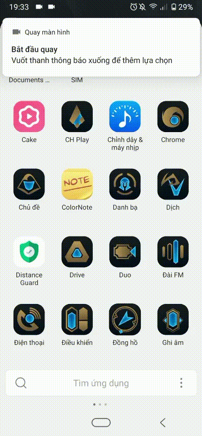

# Distance Guard Application Demo
1. Onboarding Fragment
  

2. Dashboard Fragment
  

3. Information Fragment
  

4. Map Fragment
  

5. Country List Fragment
  

6. Scan Nearby People Using BLE - Add Team Using QR Scan
  

7. Scan Nearby People With Background Mode
  

